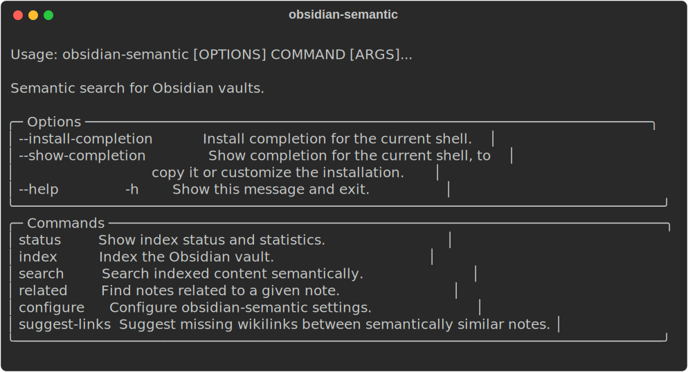

# obsidian-semantic

Semantic search for Obsidian vaults. Index your vault into vector embeddings, then search by meaning rather than keywords.

<p align="center">
  
</p>

## Setup

```bash
uv sync
uv run obsidian-semantic configure
```

Configuration is stored in `~/.config/obsidian-semantic/config.yaml`. Supports Ollama (local) and Gemini embedders.

## Usage

### Index your vault

```bash
obsidian-semantic index                # incremental (new/modified files only)
obsidian-semantic index --full         # reindex everything
```

### Search

```bash
obsidian-semantic search "dependency injection patterns"
obsidian-semantic search "python testing" --limit 5
obsidian-semantic search "docker" --folder "Programming/"
obsidian-semantic search "habits" --tag "review"
```

### Find related notes

Find notes similar to a given note, useful for discovering connections, linking, or deduplication.

```bash
obsidian-semantic related "Programming/Python/Unit Testing.md"
obsidian-semantic related "Daily/2026-02-05.md" --limit 5
```

Works with both indexed and unindexed notes -- if the note isn't in the index yet, it gets chunked and embedded on the fly.

### Suggest missing links

Find semantically similar notes that aren't linked to each other -- surfaces missing wikilinks and potential duplicates.

```bash
obsidian-semantic suggest-links
obsidian-semantic suggest-links --threshold 0.85 --limit 10
obsidian-semantic suggest-links --exclude-same-folder "Daily Log"
```

Folders to exclude can also be set in config so you don't have to type them every time:

```yaml
suggest_links:
  exclude_same_folder:
    - "Daily Log"
```

### Status

```bash
obsidian-semantic status
```

### Options

All commands accept `--vault <path>` to specify the vault. Alternatively, set `OBSIDIAN_VAULT` or configure a default with `obsidian-semantic configure --vault <path>`.

## Embedding Backends

Configuration lives in `~/.config/obsidian-semantic/config.yaml`. You can also place a `.obsidian-semantic.yaml` in your vault root to override per-vault.

After changing the embedder or model, reindex with `obsidian-semantic index --full`.

### Ollama with Nomic (default)

Local embeddings with [nomic-embed-text](https://ollama.com/library/nomic-embed-text) (768 dimensions). Uses `search_query:`/`search_document:` prefixes for asymmetric retrieval.

```yaml
vault: ~/Documents/Obsidian-Notes
embedder:
  type: ollama
  model: nomic-embed-text
  dimension: 768
  query_prefix: "search_query: "
  document_prefix: "search_document: "
```

```bash
ollama pull nomic-embed-text
```

### Ollama with Qwen3-embedding

Higher-quality embeddings with [qwen3-embedding](https://ollama.com/library/qwen3-embedding) (4096 dimensions). Uses an instruction prefix for queries to improve retrieval.

```yaml
vault: ~/Documents/Obsidian-Notes
embedder:
  type: ollama
  model: qwen3-embedding:8b
  dimension: 4096
  query_prefix: "Instruct: Given a search query, retrieve relevant notes\nQuery: "
```

```bash
ollama pull qwen3-embedding:8b
```

### Gemini

Cloud embeddings via Google's [gemini-embedding-001](https://ai.google.dev/gemini-api/docs/embeddings) (3072 dimensions). Handles query vs. document task types automatically -- no prefix config needed. Requires a `GEMINI_API_KEY` environment variable.

```yaml
vault: ~/Documents/Obsidian-Notes
embedder:
  type: gemini
  model: gemini-embedding-001
  dimension: 3072
```

### Advanced Options

**Timeout Configuration**

The embedder request timeout (default: 30 seconds) can be increased for large files or slower models:

```yaml
embedder:
  timeout: 60.0  # seconds
```

If you see timeout errors during indexing, try increasing this value. Very large notes with extensive JSON or code blocks may need 60-120 seconds.

## Automatic Indexing

### Linux (systemd)

Create a service and timer in `~/.config/systemd/user/`:

**`obsidian-semantic-index.service`**
```ini
[Unit]
Description=Index Obsidian vault for semantic search

[Service]
Type=oneshot
EnvironmentFile=%h/.config/obsidian-semantic/env
ExecStart=/home/youruser/.local/bin/obsidian-semantic index
```

**`obsidian-semantic-index.timer`**
```ini
[Unit]
Description=Run Obsidian semantic index hourly

[Timer]
OnCalendar=hourly
Persistent=true

[Install]
WantedBy=timers.target
```

The `EnvironmentFile` is optional — use it to store secrets like `GEMINI_API_KEY` outside of the main config.

Enable and start:

```bash
systemctl --user enable --now obsidian-semantic-index.timer
```

#### Multiple vaults

To index additional vaults, add more `ExecStart` lines to the service (they run sequentially):

```ini
[Service]
Type=oneshot
EnvironmentFile=%h/.config/obsidian-semantic/env
ExecStart=/home/youruser/.local/bin/obsidian-semantic index
ExecStart=/home/youruser/.local/bin/obsidian-semantic index --vault /path/to/second-vault
```

> **macOS:** Use a launchd plist instead of systemd. The CLI flags are the same; only the scheduling mechanism differs.
